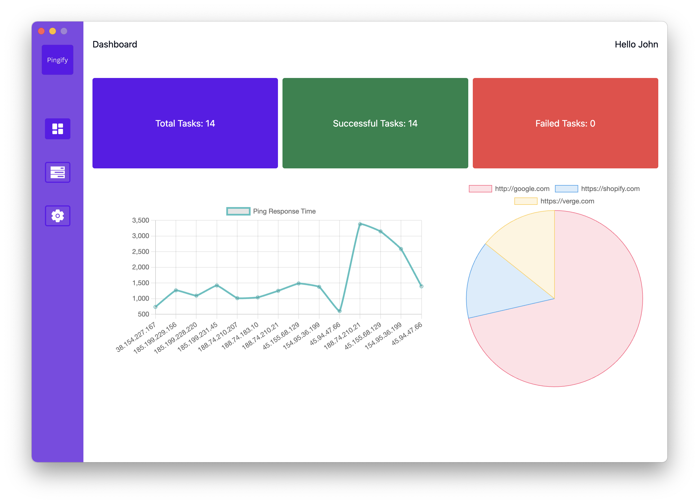
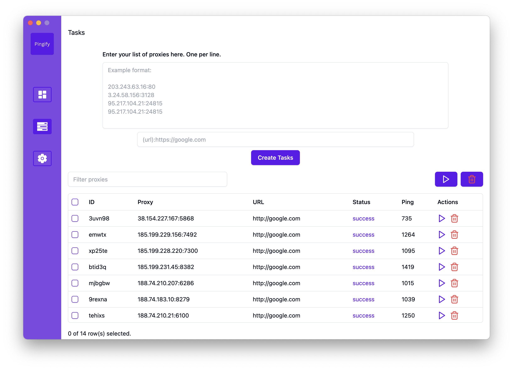

# Pingify

Pingify is a desktop application designed to streamline the process of testing proxy IPs against specified URLs. With Pingify, users can quickly assess the reliability and performance of a list of proxies, enabling informed decisions for network configurations.

## Features

- **Proxy Testing**: Pingify conducts ping tests against a target URL to evaluate the responsiveness and latency of proxy IPs.
- **Efficient Evaluation**: Users can easily test multiple proxies simultaneously, saving time and effort in the evaluation process.
- **User-Friendly Interface**: Pingify offers an intuitive interface that simplifies the testing and selection of proxies.
- **Streamlined Proxy Management**: With Pingify, users can efficiently manage their proxy infrastructures, ensuring optimal network performance.
- **Customizable Settings**: Pingify allows users to adjust settings such as timeout parameters for fine-tuning the testing process.

## How to Use

1. **Installation**: Download and install Pingify on your desktop.
2. **Add Proxies**: Input a list of proxy IPs that you want to test.
3. **Specify Target URL**: Enter the URL against which you want to test the proxies.
4. **Run Tests**: Initiate the testing process and let Pingify evaluate the proxies' performance.
5. **Review Results**: Analyze the results to make informed decisions about proxy selection and network configurations.

## Requirements

- Operating System: Windows 10, macOS, Linux
- Node.js installed on your system

## Installation

1. Clone the Pingify repository to your local machine.
2. Navigate to the project directory.
3. Install dependencies using npm or yarn:

```bash
yarn start
```






